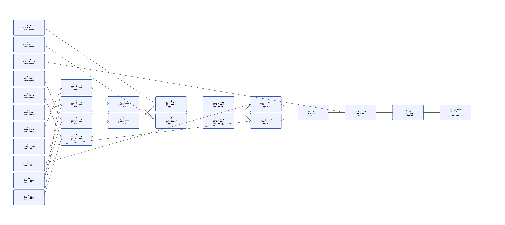
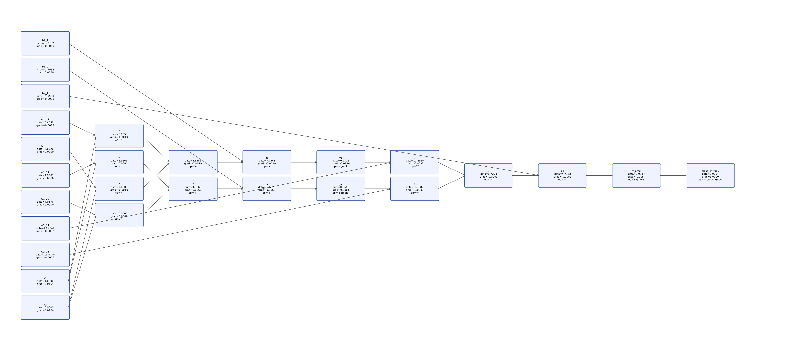
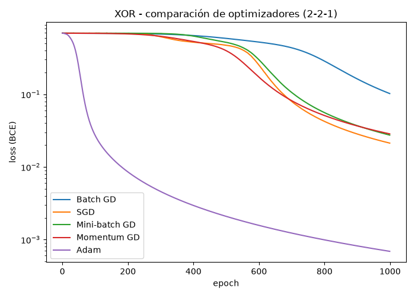

# Deber 2: Backpropagation — Compuerta XOR

Este proyecto implementa, "a mano", el forward, el backpropagation y el descenso
por gradiente de una red neuronal (usando el motor de autograd escalar Value,
al estilo micrograd) para que el modelo aprenda la compuerta **XOR**.

XOR no es linealmente separable, así que a diferencia del perceptrón simple usado
para AND, aquí se necesita una capa oculta. La arquitectura usada es la que pedía
el deber: un MLP **2-2-1**, con dos neuronas sigmoide en la capa oculta y una
neurona sigmoide en la salida, entrenado con pérdida *binary cross-entropy*.

## Resultados

Después de 3000 épocas con lr = 0.5, el modelo termina clasificando las 4
combinaciones de XOR correctamente:

| x1 | x2 | salida (sigmoid) | y_pred | y_true |
|----|----|-------------------|--------|--------|
| 0  | 0  | 0.0112            | 0      | 0      |
| 0  | 1  | 0.9917            | 1      | 1      |
| 1  | 0  | 0.9917            | 1      | 1      |
| 1  | 1  | 0.0090            | 0      | 0      |

Es decir, 100% de aciertos, con salidas bien cerca de 0 o de 1 (nada de
respuestas ambiguas cerca de 0.5), lo cual es una buena señal de que la red no
solo memorizó las etiquetas sino que encontró una separación clara del problema.

### Grafo computacional

Estas son dos "fotos" del mismo grafo computacional (ejemplo x1=1, x2=0),
igual que se vería corriendo draw_dot(...) bloque por bloque en Colab: la
primera justo después del forward (todos los grad en 0.0000, porque todavía
no se llamó a backward()) y la segunda después de backward(), ya con los
gradientes calculados en cada nodo.

## ¿En qué momento aprendió? (análisis de la curva de pérdida)

Lo interesante de ver la pérdida época a época es que el aprendizaje **no fue
progresivo desde el inicio**. Se distinguen tres fases bastante marcadas:

1. **Épocas 0–~600: casi no aprende.** La pérdida arranca en ~0.695
   (que es básicamente ln(2), o sea el valor esperado si el modelo estuviera
   adivinando al azar) y apenas se mueve durante varios cientos de épocas
   (en la época 600 sigue en 0.52). Con pesos iniciales aleatorios y una
   arquitectura no lineal, la red tarda un buen rato en encontrar una dirección
   de gradiente que realmente ayude — es como si estuviera probando distintos
   caminos sin encontrar todavía el bueno.
2. **Épocas ~650–1000: la red "entiende" el problema.** Aquí la pérdida cae de
   golpe, de ~0.49 a ~0.10 en apenas 350 épocas. Es el tramo donde las dos
   neuronas ocultas empiezan a especializarse (cada una separando una de las
   dos "franjas" del problema XOR) y la neurona de salida aprende a combinarlas.
3. **Épocas 1000–3000: ajuste fino, cada vez más lento.** De ahí en adelante la
   pérdida sigue bajando de forma constante (0.054 → 0.030 → 0.016 → 0.009...),
   pero cada vez con mejoras más pequeñas: cuesta cada vez más sacarle un poco
   más de mejora. Para la época 2999 la pérdida es 0.0093 y **todavía sigue bajando** — no llegó
   a aplanarse del todo, simplemente la mejora por época se vuelve tan pequeña
   que ya no se nota a simple vista. En la práctica, con las salidas ya tan
   cerca de 0/1 (ver tabla de arriba), seguir entrenando más épocas sigue
   ayudando, pero cada vez aporta menos.

En resumen: el modelo no "deja de aprender" en un punto exacto, sino que pasa de
no aprender casi nada, a aprender muy rápido, a aprender cada vez más despacio
pero sin estancarse del todo dentro de las 3000 épocas usadas. La curva completa
queda guardada en [resultados/deber_v1/loss_xor.png](resultados/deber_v1/loss_xor.png)
para verla de un vistazo.

## Versión 2: Usando otros optimizadores 

La versión 1 usa el descenso por gradiente más simple posible (mismo lr para
todos los parámetros, un solo update por época usando todo el dataset) y por
eso necesita ~1200-1300 épocas solo para bajar de loss = 0.05. La pregunta
natural es: ¿se puede aprender XOR en muchas menos épocas usando un mejor
optimizador? Para responder eso, [deber_v2.py](deber_v2.py) entrena la **misma**
arquitectura 2-2-1, partiendo de los **mismos** pesos iniciales, con 5
variantes distintas, separando dos decisiones que en la práctica son
independientes:

- **Cuántas muestras se usan por actualización (tamaño de batch):**
  - *Batch GD*: las 4 muestras de XOR juntas, 1 actualización por época.
  - *SGD*: 1 muestra a la vez (orden aleatorio), 4 actualizaciones por época.
  - *Mini-batch GD*: de a 2 muestras, 2 actualizaciones por época.
- **Qué regla usa el gradiente para actualizar los pesos:**
  - *GD "vanilla"*: w = w - lr * grad (la usan Batch GD, SGD y Mini-batch GD).
  - *Momentum*: acumula una media móvil del gradiente (una "inercia") y usa
    eso en vez del gradiente tal cual, lo que suaviza el ruido y ayuda a
    avanzar en las zonas donde la pérdida casi no cambia.
  - *Adam*: combina momentum con un escalado adaptativo por parámetro (usa
    también una media móvil del gradiente al cuadrado), lo que en la práctica
    le permite dar pasos grandes donde el gradiente es chico y consistente.

### Resultados (1000 épocas, mismo seed para los 5)

| Optimizador     | loss final | accuracy | primera época con loss < 0.05 |
|-----------------|-----------:|---------:|-------------------------------:|
| Batch GD        | 0.1023     | 100%     | no llegó en 1000 épocas        |
| SGD             | 0.0213     | 100%     | 768                             |
| Mini-batch GD   | 0.0274     | 100%     | 824                             |
| Momentum GD     | 0.0285     | 100%     | 806                             |
| **Adam**        | **0.0007** | 100%     | **78**                          |

### Análisis

Lo primero que salta a la vista es que **Adam le saca una diferencia enorme
al resto**: llega a loss < 0.05 en la época 78, mientras que los demás recién
lo logran pasadas las 750-825 épocas (Batch GD ni siquiera lo logra en 1000).
Es decir, Adam aprende XOR con **~10 veces menos épocas** que las variantes de
gradiente descendiente "puro". Esto tiene sentido: Adam ajusta el tamaño de
paso *por parámetro* según qué tan grande y consistente viene siendo su
gradiente, así que al principio, cuando casi no aprende (donde los gradientes
son pequeños, ver el análisis de la versión 1) puede seguir dando pasos
relativamente grandes en vez de arrastrarse como el GD clásico.

Entre las otras cuatro, la diferencia es mucho más chica: SGD, Mini-batch GD y
Momentum GD terminan bastante parejos (épocas 768-824 para cruzar el umbral),
todos claramente mejor que Batch GD. Tiene sentido para SGD y Mini-batch GD,
porque hacen 4 y 2 actualizaciones por época respectivamente (contra 1 sola de
Batch GD), o sea que a igual cantidad de "épocas" en realidad dieron más pasos
de descenso. Momentum GD, en cambio, hace también 1 actualización por época
igual que Batch GD, pero le gana claramente (806 contra "no llegó"): ahí sí se
nota el efecto de la inercia acumulada ayudando a avanzar más rápido al
principio, cuando el gradiente solo (sin inercia) casi no mueve los pesos.

En definitiva: si hay que elegir uno solo para este problema, **Adam es la
mejor opción por lejos** (menos épocas, menor loss final, sin ningún ajuste
fino de hiperparámetros más allá de los valores típicos lr=0.1). El resto de
las variantes son todas razonables mejoras sobre el Batch GD "a secas" de la
versión 1, pero ninguna se acerca a la velocidad de Adam en este problema.